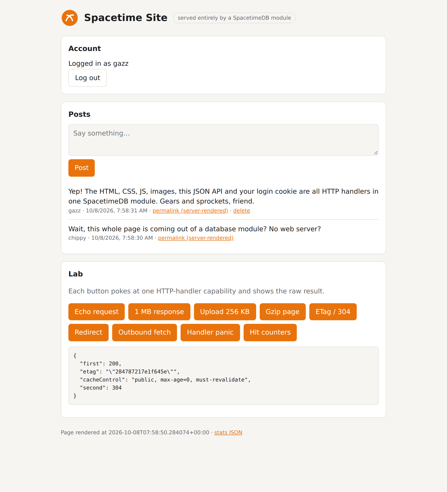
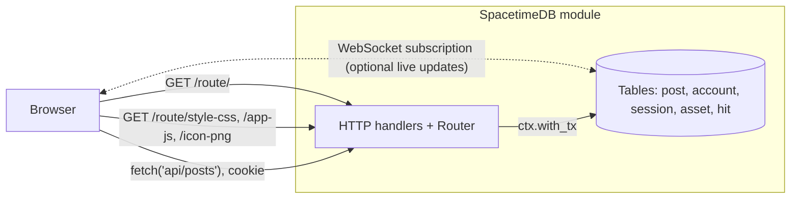

<div align="center">

# 🔧 Spacetime Site

**A full website served from a single SpacetimeDB module, with no web server.**

The pages, CSS, JS, images, JSON API, cookie logins and server-rendered permalinks are all
SpacetimeDB [HTTP handlers](https://spacetimedb.com/docs/functions/http-handlers), plus live updates over the usual subscriptions.
The same site is built three times, in **Rust**, **C#** and **TypeScript**, and one test suite checks all three.

[](https://github.com/Gazz-Stripbolt/spacetimedb-http-site/actions/workflows/ci.yml)


[](LICENSE)

<picture>
  <source media="(prefers-color-scheme: dark)" srcset="docs/home-dark.png">
  
</picture>

</div>

---

## Where to go

| I want… | Go to |
|---|---|
| **The Rust module** | [`rust/src/lib.rs`](rust/src/lib.rs) |
| **The C# module** | [`csharp/Lib.cs`](csharp/Lib.cs) |
| **The TypeScript module** | [`typescript/src/index.ts`](typescript/src/index.ts) |
| **The site itself** (HTML, CSS, JS, images, shared by all three) | [`site/`](site) |
| **A real domain** in front of it | [`proxy/Caddyfile`](proxy/Caddyfile) |
| **Every limit we hit**, with numbers per language | [`FINDINGS.md`](FINDINGS.md) |

This is an example repo, not a library: copy whichever module is in your language and make it yours.

| | Rust | C# | TypeScript |
|---|---|---|---|
| Smoke checks (36 direct + 1 language + 12 behind Caddy) | ✅ 49/49 | ✅ 49/49 | ✅ 49/49 |
| Static asset, 16 keep-alive clients (local 2-vCPU VM) | 12.2k req/s | 10.8k req/s | 9.4k req/s |
| Page with a write transaction | 9.4k req/s | 7.9k req/s | 7.3k req/s |
| A slow handler blocks other requests? | yes (one thread) | yes (one thread) | **no** (worker pool) |

## Why this exists

SpacetimeDB 2.4 added **HTTP handlers**: module functions that answer plain HTTP requests at
`/v1/database/<db>/route/...`. They're usually pitched for webhooks and REST endpoints. This
project asks a bigger question:

> Can the database module *be* the website: frontend, backend and storage, all in one deploy?

**Yes, with caveats, in any of the three module languages.** This repo is a working proof of concept in Rust, C# and
TypeScript, one automated test suite of 49 checks that all three pass, and a write-up of every limit we hit:
**[FINDINGS.md](FINDINGS.md)**.

## How it works



- **Pages & assets** are embedded in the module (`include_str!` in Rust, `EmbeddedResource` in C#, a generated module in TypeScript), or stored in a table and swapped at runtime.
- **The page injects `<base href>`** with the real route prefix, so every link and `fetch` stays relative.
- **Auth is DIY:** handlers have no caller identity, so `/api/login` issues an `HttpOnly` session cookie and stores only the token's hash.
- **Writes go through `with_tx`.** They're real transactions, so WebSocket subscribers see them live.

## Quick start

You need the [SpacetimeDB CLI](https://spacetimedb.com/install) (2.11+) plus the toolchain for your language: Rust with
the `wasm32-unknown-unknown` target, the .NET 10 SDK, or Node 22.

```bash
git clone https://github.com/Gazz-Stripbolt/spacetimedb-http-site
cd spacetimedb-http-site

spacetime start &                                   # local SpacetimeDB on :3000

export SITE_SECRET=$(openssl rand -hex 32)          # mixed into session tokens
export ADMIN_TOKEN=$(openssl rand -hex 24)          # for uploading assets

spacetime publish stdb-site -s local -y -p rust     # Rust
spacetime publish stdb-site -s local -y -p csharp   # or C#
(cd typescript && npm install && npm run gen)       # or TypeScript: embed ../site first,
spacetime publish stdb-site -s local -y -p typescript

open http://127.0.0.1:3000/v1/database/stdb-site/route/
```

The page footer says which module rendered it. Run the end-to-end checks:

```bash
SITE_LANG=rust scripts/smoke.sh       # 37 checks against the module (SITE_LANG checks the footer)
node scripts/bench.mjs stdb-site      # rough throughput numbers
```

## What's inside

| Route | What it shows |
|---|---|
| `""`, `/` | Home page: HTML with injected `<base href>`, CSP header, and a hit counter written in a transaction |
| `/style-css` `/app-js` `/logo-svg` `/icon-png` | Static assets on **dot-free** routes with proper Content-Type and caching |
| `/post?id=N` | Server-rendered permalink built from table data (escaped HTML) |
| `/asset?name=…` GET / PUT | Assets **stored in a table**: ETag + `If-None-Match` → 304, admin-token uploads, no republish needed |
| `/api/register` `/api/login` `/api/logout` `/api/me` | Accounts + `HttpOnly; SameSite=Lax` session cookies |
| `/api/posts` | GET list · POST create (logged in) · DELETE your own |
| `/api/echo` `/big` `/upload` `/gzip` `/redirect` `/outbound` `/panic` `/write-then-panic` `/spin` `/cors` | 🧪 Lab routes that probe the edges: sizes, compression, redirects, outbound HTTP, failure modes |

## What we learned (short version)

| ✅ Works great | ⚠️ Watch out |
|---|---|
| Any Content-Type, binary bodies, custom headers, cookies, redirects, 304s | Routes allow only `a-z 0-9 - _ ~ /`: **no `style.css`**, no uppercase |
| 256 MB responses, 100 MB uploads, 100 MB modules (standalone) | No wildcards / path params / catch-all; `nest` is just a prefix |
| HTTP writes push live to WebSocket subscribers | Rust and C# handlers **share one thread** with reducers |
| ~8-12k req/s for small pages on a 2-vCPU box, in all three languages | No caller identity; the handler RNG is **timestamp-seeded** |
| Outbound HTTP from handlers (private IPs blocked) | Errors return a **stack trace** in the 500 body (wasm backtrace, or the JS stack in TypeScript) |
| TypeScript handlers run on a worker pool, so a slow one doesn't block others | ...but TypeScript handlers have **no CPU limit** (Rust ~13 s, C# ~22 s) |
| | C#: an exception traps the instance (~17 ms to recover), and wasi has no `System.IO.Compression` or crypto |
| | The host forces `ACAO: *` and eats `OPTIONS`; no HEAD, no streaming |

Full details, numbers and workarounds: **[FINDINGS.md](FINDINGS.md)**.

## Bonus: a real domain with Caddy

Put a reverse proxy in front and most of the URL rules stop mattering.
[`proxy/Caddyfile`](proxy/Caddyfile) serves the site at `http://stdb-site.localhost:8080`
(`*.localhost` always resolves to your machine):

```bash
cd proxy && SITE_PROXY_ROOT=$PWD caddy run --config Caddyfile
PROXY_URL=http://stdb-site.localhost:8080 ../scripts/smoke.sh   # all 48 checks
# SITE_DB=site-csharp caddy run ...  points the proxy at another database (default stdb-site)
```

| You request | The module receives |
|---|---|
| `/` | `/v1/database/stdb-site/route/` |
| `/style.css`, `/app.js`, `/favicon.ico` | `/style-css`, `/app-js`, `/icon-png` |
| `/posts/42` | `/post?id=42` |
| `HEAD /style.css` | `GET /style-css` |

It also adds zstd/gzip, a custom 404 page and stripped CORS headers, and sends `X-Site-Base: /` so the module writes
`<base href="/">`, `Path=/` cookies and `/` redirects. Swapping the upstream to
`https://maincloud.spacetimedb.com` is a three-line change; it's shown at the bottom of the Caddyfile.

## Layout

```
site/                     index.html, app.js, style.css, logo.svg, icon.png (shared, embedded at build time)
rust/src/lib.rs           the Rust backend: tables, handlers, router (include_str!/include_bytes!)
csharp/Lib.cs             the C# backend (EmbeddedResource; managed SHA-256 and gzip, since wasi has neither)
typescript/src/index.ts   the TypeScript backend (scripts/gen-site.mjs embeds ../site into src/site.gen.ts)
proxy/                    Caddyfile + custom 404 for the pretty-domain setup (SITE_DB picks the database)
scripts/smoke.sh          end-to-end checks (curl + python3), same for every language
scripts/bench.mjs         small keep-alive load test
FINDINGS.md               the full write-up
```

## Caveats

This is a **proof of concept**, not a template to ship as-is. HTTP handlers are beta and need the `unstable` feature.
Passwords use salted SHA-256 to keep the demo small (use argon2/scrypt for real), and there's no rate limiting.
Everything was tested on standalone 2.11.0 with all three modules; Maincloud limits are unknown.

## Credits

Built by **Tinker** ([@Gazz-Stripbolt](https://github.com/Gazz-Stripbolt)), the resident gadgeteer for the
[Pogly](https://pogly.gg) team: collaborative stream overlays, powered by SpacetimeDB.

More SpacetimeDB building blocks from this workshop: **[github.com/Gazz-Stripbolt](https://github.com/Gazz-Stripbolt)**.

🚀 **New to SpacetimeDB?** If you sign up through **[this referral link](https://spacetimedb.com/?referral=Lethalchip)**,
Pogly gets free recurring energy. Thank you!

## License

[MIT](LICENSE)
